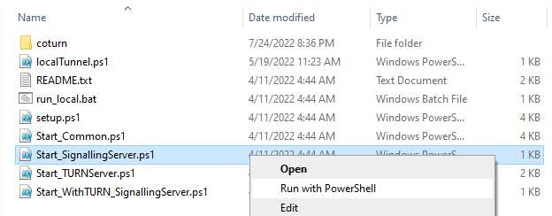
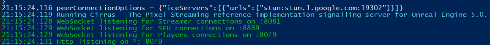
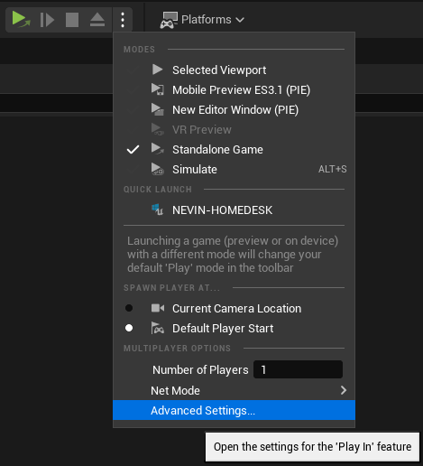
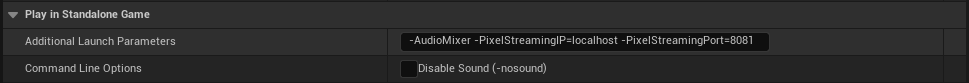
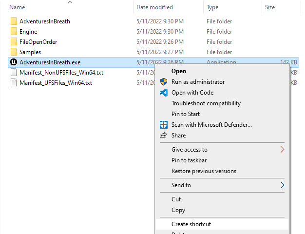
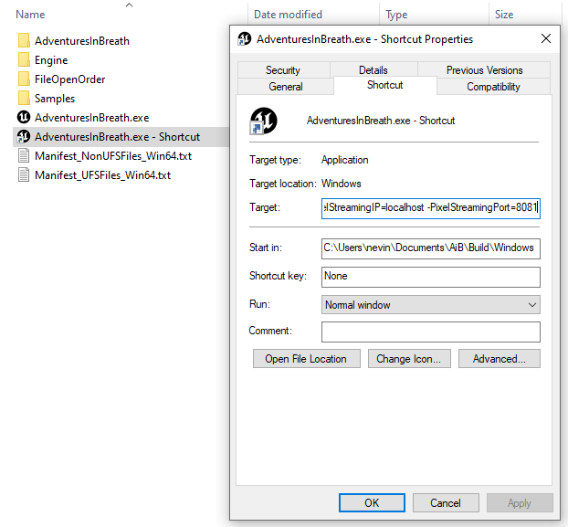
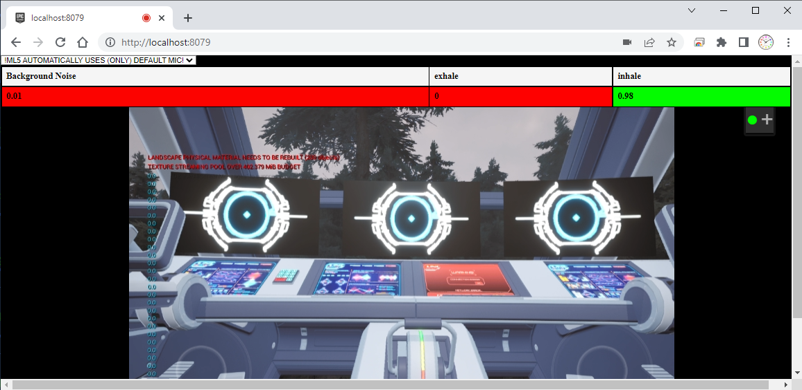
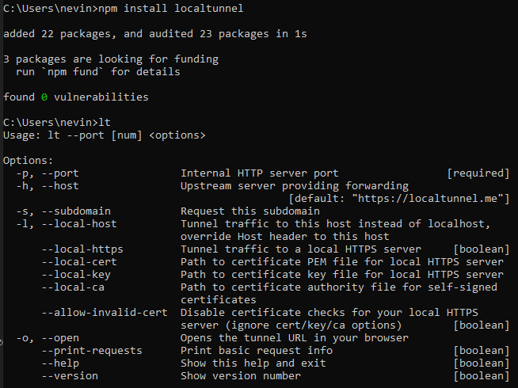

# Adventures in Breath
## Adventures In Breath: Game that responds to YOU
This repository has three main features:
1. Unity C# code for Microphone and breath mechanics.
2. An unreal project for the AiB Flagship game.
3. Pixel Streaming code intended to extend the AiB Flagship game to in browser streaming.

---
# Pixel Streaming
All code needed to run a server for pixel streaming can be found in the `./SignallingWebServer` folder.

## Quick Setup
*This section will assume that you are running on a windows machine. Linux based machines can work but are untested.*

1. **Install node.js**. If you don't already have node.js installed on your computer, you'll need to [download and install it](https://nodejs.org/en/download/).
2. **Stop other web servers** on ports 8081 AND 8079. If your computer is running any other Web servers that use these ports stop them for now OR go to the configure section of pixel streaming.
3. Start a **Pixel Streaming Server** using Windows Powershell Scripts.
	- Run the following script with powershell: `./SignallingWebServer/platform_scripts/cmd/Start_SignallingServer.ps1`
	
	- You will know if this script is successful if the prompt ends with the following text:
	```
	WebSocket listening for Streamer connections on :8081
	WebSocket listening for SFU connections on :8889
	WebSocket listening for Players connections on :8079
	Http listening on *: 8079
	```
	
4. Run AiB as a standalone game with Pixel Streaming **Launch Parameters**.
	- If in Unreal Editor, go to Advanced Play settings in the editor settings.
	
	- Add the following line to the `Additional Launch Parameters`
	```
	-AudioMixer -PixelStreamingIP=localhost -PixelStreamingPort=8081
	```
	
	- You can also do this from a Windows build by creating a shortcut for the executable and appending the parameters above to the `Target` field:
	
	
5. **Verify** that local Pixel Streaming is running.
	- In a web browser ON THE SAME DEVICE, go to the following url: http://localhost:8079
	
	- Note that only some browsers will support microphone on local servers WITHOUT https.
6. **Enable HTTPS** using local tunnel OR certificate. This is NEEDED for step 7. *This doc will only explain local tunnel as certificates are fairly hard to setup and will only work locally without a domain.*
	- Install Local Tunnel using node.js. Go to a command prompt and run the following:
	```
	npm install localtunnel
	```
	- Verify that localtunnel is installed and can run by running `lt` in the command prompt.
	
	- Start a local tunnel using the following command. The subdomain is not important but will let you chose the url a little:
	```
	lt --port 8079 --subdomain versebuilding-AiB
	```
7. **Setup Port Forwarding** so you can Pixel Stream to any computer. This is VERY specific to your internet setup so look up tutorials online.

## Configuration
If you need to change the ports that are being used by default, you can change the values in the following file: `./SignallingWebServer/config.json`